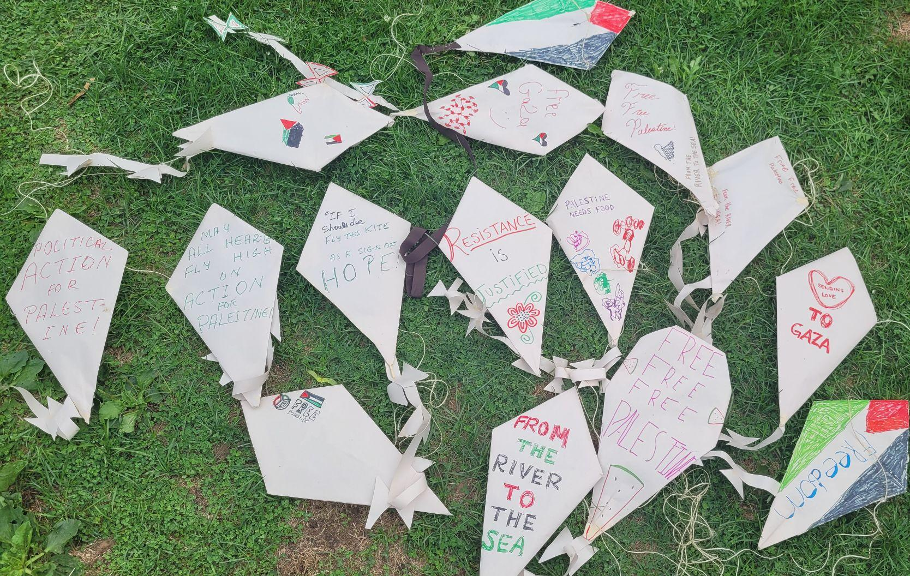
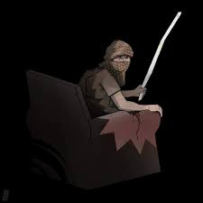
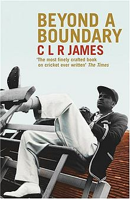
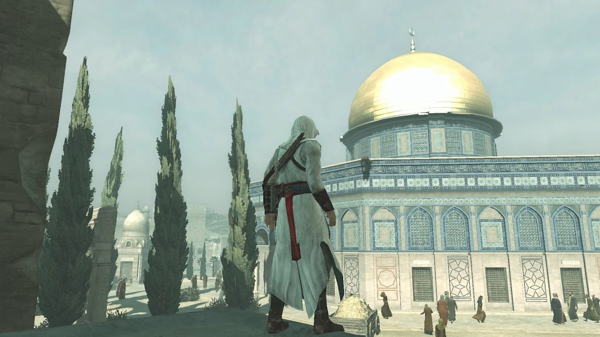
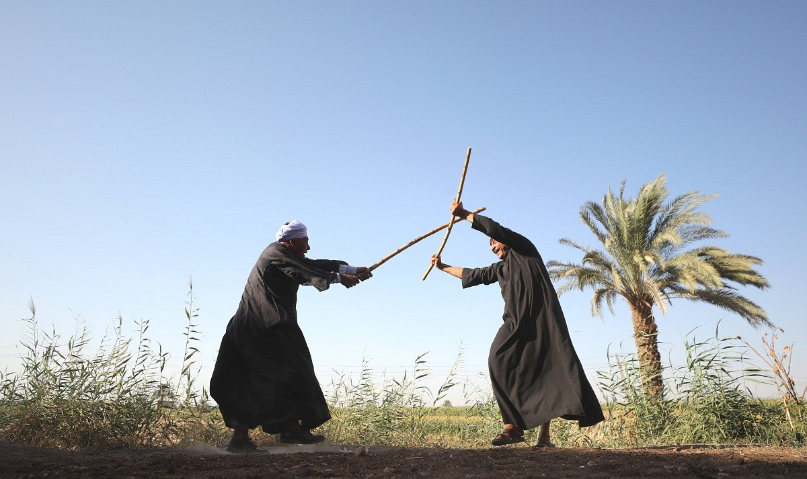

## Forging a Culture of Resistance: Artifact and Process

{height=400px}

<aside class="notes">

We are going to be looking at the Palestinian struggle for liberation to learn some lessons about resistance. 
What can we learn from this ongoing anti-colonial process? 
What artifacts are generated in the process, and how are they generated?

Let’s begin with a quote from Dr. Refaat Alareer, a prominent Palestinian poet that was assinated by the israeli regime last year.

</aside>

## The Power of Imagination

> [Before] Palestinians can live in a free Palestine, they have to create a free Palestine in their imagination through stories, films, novels, and the arts [@alareerIfMustPoetry2024, p. xviii].

<aside class="notes">

And as I’ll argue in this presentation also through games. Liberation is a process, not an event. What better medium to model process than games? Basically any medium that allows for a conversation between the people and her future can be an instrument of liberation. Therefore, for a culture of resistance to form, the people resisting need to envision a future. 
    
</aside>

## Rejecting a conversation between the sword and the neck

<video controls>
	<source src="ghassan-kanafani.mp4" type="video/mp4">
</video>

<aside class="notes">

I’m going to play a short segment of an interview with Ghassan Kanafani (a Palestinian freedom fighter from the 60s) that does a good job articulating why Palestinians have a conversation with the future instead of a conversation with their oppressors.

</aside>

## Free From What?

{height=400px}

<aside class="notes">

That isn’t to say that Palestinians don’t learn about the culture of their oppressor. In fact Kanafani himself wrote an extensive book on Zionist Literature that was recently translated into English. As any oppressed people will tell you, they know more about their oppressors than the oppressors know about themselves. 

Forging a culture of resistance is less about the embedded traits of the people who resist, but are a product of the situation imposed on them by those that wield the power. Therefore, it’s important for those creating a culture of resistance to know about the culture of those who seek to dominate them.

In fact, it’s the oppressor who decides what resistance even looks like in the first place.

</aside>

## Who Decides the Mode of Resistance?

> The Algerian's criminality, his impulsivity, and the violence of his murders are therefore not the consequence of the organization of his nervous system or of characterial originality, but the direct product of the colonial situation [@fanonWretchedEarth2002].

<aside class="notes">

In the 50s and 60s labour zionism (a secular so-called socialist zionism) was the primary form of oppression for the Palestinian people. At that time, the popular front for the liberation of Palestine (PFLP) (a marxist organization) was the primary resistance organization. Fast-forward to today, Zionism has taken on a primarily messianic religious character and so to meet the moment the primary resistance org is Ḥarakat al-Muqāwamah al-ʾIslāmiyyah (Islamic resistance movement or HAMAS). 

</aside>

## The Sword

{height=400px}

<aside class="notes">

Pictured here is the aftermath of the Israeli invasion of northern Gaza. The israelis used a holy symbol to vandalize Gaza, many jewish scholars condemning this vile act.

</aside>

## Semiotics of Social Justice

{height=400px}

<aside class="notes">

Semiotics is the study of signs and symbols and how they create meaning. It explores how signs communicate both intentional and unintentional messages in various forms, including language, images, and gestures.

According to @hawreliakSemioticsSocialJustice2020: “Videogames are uniquely situated to represent systemic oppression and privilege through what Ian Bogost calls ‘procedural rhetoric,’ i.e. the representation of systems through computational media. The [high multimodality] of Videogames allows players to experience and interact with systems of oppression and privilege in ways that other media cannot”

</aside>

## Revolutionary Objects

The Kite, The Key

{height=200px} {height=200px}

The Stick, The Gun

{height=200px}{height=200px}

<aside class="notes">

Pictured here are some “revolutionary objects” in Palestinian culture as described by @matarForgingRevolutionaryObjects2024. Each one of these objects was forged by the struggle. Their use in the liberation struggle making them artifacts of liberation. The stick brandished by Sinwar in his final moment (pictured bottom left) is being connected to the staff of Moses (pbuh) on Arab social media. Moses was a prophet shared by Muslims and Jews and the story of Moses throwing his staff down was meant to teach us courage.

In this way anti-colonial process creates symbols of resistance. 

Games that seek to become media for social justice in the Palestinian context must incorporate these revolutionary objects within their play. How might we go about that?

(Describe each if time allows)

(Optional)
If I must die,
you must live
to tell my story
to sell my things
to buy a piece of cloth
and some strings,
(make it white with a long tail)
so that a child, somewhere in Gaza
while looking heaven in the eye
awaiting his dad who left in a blaze–
and bid no one farewell
not even to his flesh
not even to himself–
sees the kite, my kite you made, flying up above
and thinks for a moment an angel is there
bringing back love
If I must die
let it bring hope
let it be a tale

</aside>

## How Games Transmit Culture

{height=400px}

<aside class="notes">

Pictured is the book cover for “Beyond a Boundary” by CLR James. The book is ostensibly about cricket and James’ life growing up in colonial Trinidad, and demonstrates the connections between race, class, values, and play. The British culturally cultivated play in order to further their colonial rule over Trinidad.

Players learn about culture through engaging with games. In James’ case he was being taught British culture by way of engaging with cricket. Passively through the environment and actively through the rules and systems of the game.

While our goals are different, the tools of cultural transmission are the same.

To that end for engagement to be successful in teaching culture it needs to have 2 main features:
1. An appealing and meaningful environment and;
2. A suited and intuitive interaction paradigm

</aside>

## Meaningful Environments

{height=400px}

<aside class="notes">

Our brains release chemicals based on the environment we are in. When we learn in the same environment we intend to use the skills in, we do much better. Therefore, it’s important that whatever environment we want to use a skill within, is emulated by our game.
    
</aside>

## Suited and Intuitive Interaction Paradigm

{height=400px}

<aside class="notes">

Allow me to tell a controversial story. I did a year of elementary school in Lebanon in 2005. The atmosphere was obviously tense and even a 2nd grader like myself could tell. Why? Because the older kids had started to smuggle BB guns into school! New kid with the “American” accent was going to get picked on obviously, so I was often shooting practice. It got so bad that at one point the principal took pity on me and gave me a BB gun he had confiscated from one of the kids. Once I was no longer at such a disadvantage I remember having a bit of fun with the whole situation. Although it was frowned upon by the adults, the kids were forced by circumstance to learn about guns and warfare. We made a game of it.

In 2006 Israel invaded Lebanon, and I was forced to leave. Now I wonder if the kids who I played bb guns with are now members of Hezbollah because of the Israeli invasion last year. What would you do if a two ton bomb hit your school, killing your children? What would you do if Israeli soldiers who have a systematic rape policy were besieging your villages?
    
</aside>

## Towards a Conclusion

{height=400px}

<aside class="notes">

My research seeks to create cultural continuity in the hope that Palestinian resistance culture can continue to grow and evolve. Right now I’m looking into Egyptian stick fencing, which is surprisingly under researched in English. It’s my hope that by connecting games across history, the methodology for creating videogames of resistance will become obvious (or at least more apparent).

I hope that one day Palestinian games can be like Stardew Valley in Jaffa depicting Palestinians farming oranges on the land. That I don’t have to talk about resistance and violence and can instead talk about building and the future. Until then, I’ll keep researching ways we can continue to create a culture capable of fighting colonization.

</aside>

## References