## Land Acknowlegement
<aside class="notes">
First though I'd like to acknowledge the land on which we gather is the traditional territory of the Hatiwendaronk, Anishinaabe including Mississaugas of the Credit First Nation, Haudenosaunee, and Wendat, many of whom continue to live and work here today. This territory is within the land protected by the Dish with One Spoon Wampum Agreement. 
I also acknowledge that this land was forcefully taken from its original stewards and that this land acknowledgement is just the first step in our reconciliation. We stand firmly with all Indigenous peoples, past and present, in their struggles against colonialism, wherever they are, and trust in their stewardship of their traditional homelands.
</aside>

## Agenda

1. “Serious” Media and the Anti-Colonial Discursive Framework
2. Contradiction of cultures: The Indigenous and the colonizer
3. Overview
4. Key Concept 1: Serious Games for Culture, History, and Heritage
5. Key Concept 2: Context of Use

---

## Some Theory

But only some, I promise

## “Serious” Media

{height=450px width=320px class="fragment" data-fragment-index="0"} {height=100px class="fragment" data-fragment-index="2" style="margin-bottom: 190px"} 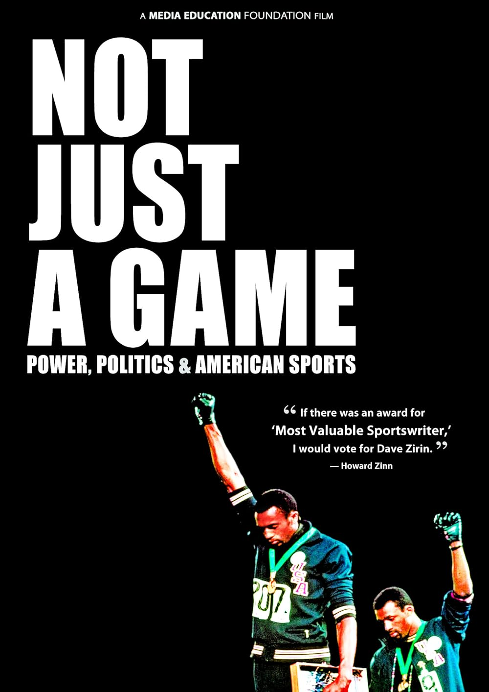{height=450px class="fragment" data-fragment-index="1"}

<aside class="notes">
    
- I’m taking a term from Game Studies (my field) and applying it more boardly

- Serious games differ from common e-learning apps by their balance of gaming aspects
    - game interactions should not be a superficial layer on top of the learning content, nor should the learning content be of secondary importance.
- I don’t see any reason why this can’t apply to movies, books, and the like. Perhaps games being what they are makes the distinction less tangible, and so it has to be spoken about more specifically. Often times it’s obvious when a book is “serious” or pure entertainment as example.
    
- The learning implements a pedagogical approach, by structuring the educational content and organizing its presentation. That their purpose is educational.

- I want to interrogate this concept of "purpose." Who gets to decide the purpose? One might say the purpose of football is "just entertainment," I many argue otherwise. Can games that appear to be “just entertainment” on the surface, be serious games in disguise?
- Are all games “serious” then?

[@prodigyeducationLearnGrowYour2022;@earpNotJustGame2010]
</aside>

## Anti-Colonial theory and discourse
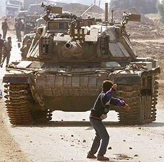{height=400px}

<aside class="notes">

> [Anti-colonialism] interrogates the power configurations embedded in ideas, cultures, and histories of knowledge production, validation, and use. It also examines our understanding of indigeneity, pursuit of agency, resistance, and subjective politics (Foucault, 1983; Moore, 1997)
    
Now what about discourse? What's the difference between theory and discourse? Here specifically it's an:

> [Epistemology] of the colonized, anchored in the indigenous sense of collective and common colonial consciousness [@deiPowerSocialTheory2001, p. 300]

I bring this up because this is the discursive framework we will be operating under in this seminar. Basically our discourse ought to reflect the fact that:

> [There] is no such thing as self-professed impartiality, non partisanship, and indifference; that discursive practices are never neutral or apolitical and that historical accounts and narratives are shaped and socially conditioned by particular interests, histories, desires, and politics [@deiPowerSocialTheory2001, p. 318]
</aside>

## Contradiction of Cultures

> [The] contradictions between the indigenous culture of the colonized and occupied, which encourages and fosters resistance, and that of the imperialist culture, which, among other things, criminalizes anti-colonial and anti-imperialist struggles and resistance and transforms the latter into terrorism, is best exemplified by the Palestinian case [@abdoCaptiveRevolutionPalestinian2014, p. 84].

<aside class="notes">
    
- In that spirit, allow me to articulate my partisanship. (Read quote)
- I am a partisan of Indigenous culture opposed to the culture of the colonizer.
</aside>

---

## Overview
 

 How teach? 

<ul>
    <li class="fragment">Cognitive</li>
    <li class="fragment">Psychomotor</li>
    <li class="fragment">Affective</li>
</ul>

<aside class="notes">
    
We’re going break down a cultural classification system, and a learning classification system. Hopefully by the end of this talk, we will walk out understand what it is we are trying to express, and how our expression can be effective.

First we have three main types of goals in learning: cognitive, psychomotor and affective
- cognitive is mental skills and intellectual development
- psychomotor is physical coordination and motor skills
- affective is emotional attitudes, values, and appreciation
  
Keep this in mind as we discuss what components of culture we are attempting to express
</aside>

---

## Tangible Culture
{width=400px class="fragment" }

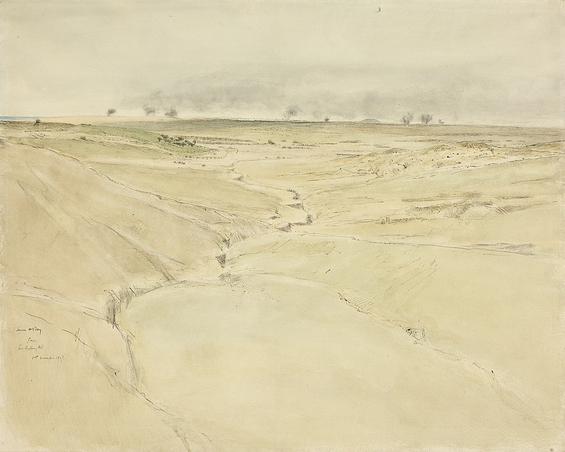{height=250px class="fragment" } 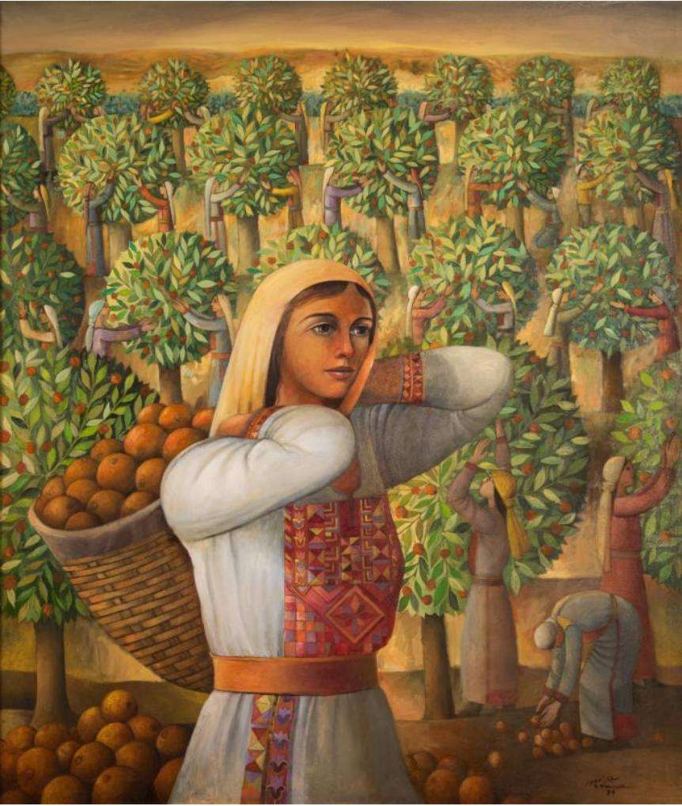{height=250px class="fragment" } 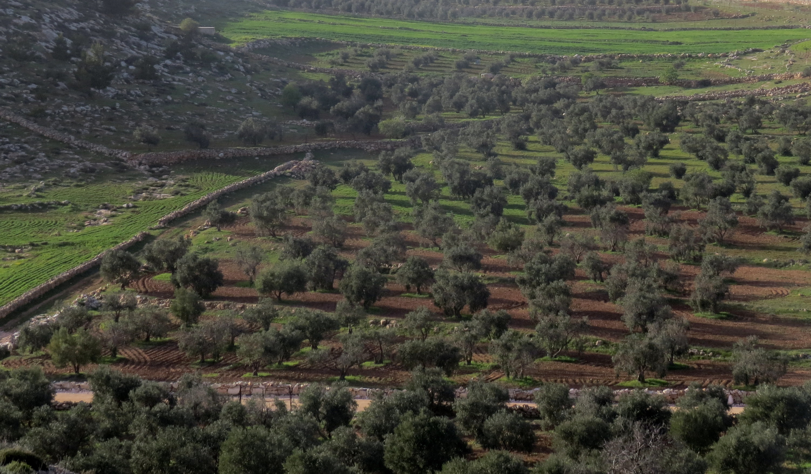{height=250px width=300px class="fragment"}

<aside class="notes">

The article makes a distinction between “tanigle” and “intangible” culture. Let’s give some examples of Tangible culture.

- historical sites/buildings, monuments, documents, works of art, machines and other artifacts
- Natural environment: landscapes, flora and fauna, geological, paleontological and morphological
    
Andrew Shiva / Wikipedia / CC BY-SA 4.0 
بدارين/ Wikimedia / CC BY-SA 4.0 
[@jamesmcbeyEnglishGatePalestine1917]
سليمان منصور 79
</aside>

## Intangible Culture
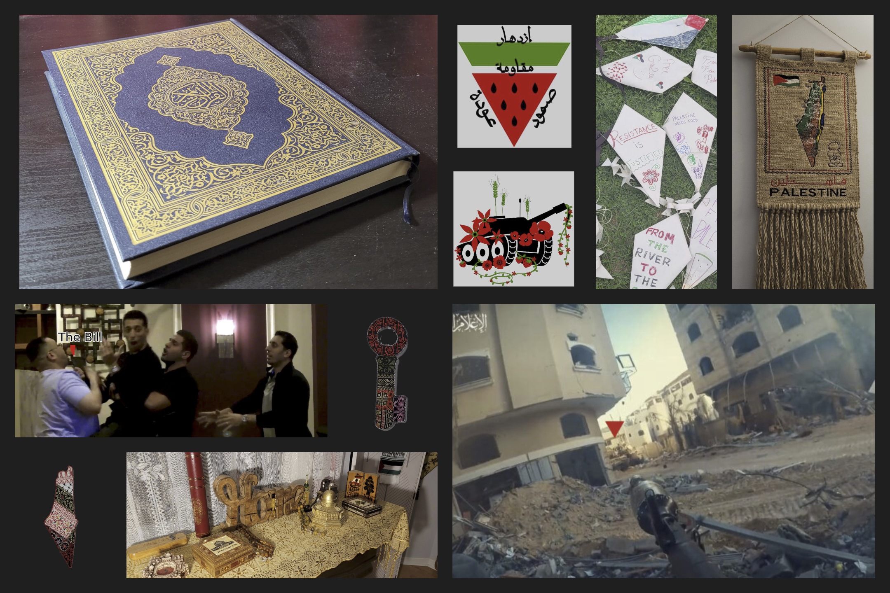

<aside class="notes">
What about intangible culture? Particularly difficult to preserve, sometimes even difficult to articulate (which is why I've provided some visual aids ahead of the discussion). Can we name some “intangible” cultural components? Bonus points if you can connect them to the collage.
    
- Social values and traditions
    - Religion
    - Customs and practices
    - artistic expression
    - Language
    - Folklore
    - Philosophical values

The article says that serious Games have the largest potential here. That serious games can more easily represent intangible culture. Why do we think that is?

</aside>

## Key Concept 1: Serious Games for Culture, History, and Heritage

<aside class="notes">
 Now let's get into the key component of the taxonomy the article puts forward.
</aside>

## Cultural Awareness
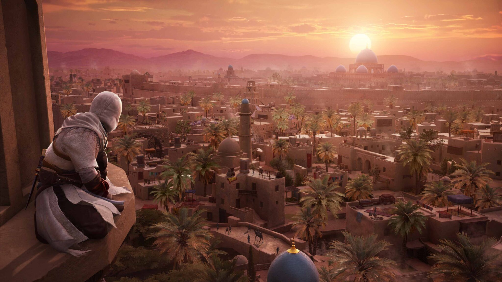

<aside class="notes">
    Ahhh ubisoft. Love hate relationship with you.
</aside>

## Call to Prayer
<iframe width="560" height="315" src="https://www.youtube.com/embed/tesHn9YvhPg?si=_TA2YWxZTsiDsg2O" title="YouTube video player" frameborder="0" allowfullscreen></iframe>

<aside class="notes">
[Talk about the call to Prayer echoing in the homeland then play video]

What learning goals are being achieved here according to Bloom’s learning goals (Cognitive, psychomotor, affective).
</aside>

## Normalizing Prayer

<iframe width="560" height="315" src="https://www.youtube.com/embed/OL2X6P6NxZQ?si=l3edr8cwo48fJvi-" title="YouTube video player" frameborder="0" allowfullscreen></iframe>

<aside class="notes">
[Talk about my experience praying in public]
Bloom’s learning goals (Cognitive, psychomotor, affective)

Is Assassin’s creed a “Serious game?” 

Having these be common aspects of the game, I believe, creates an awareness of cultural aspects of Muslim nations.
</aside>

## Post Script
{height=400px}

<aside class="notes">

Assassin’s creed is an old series. The first game came out when I was 8, I want to say I played a bit of it at a friends house. I was stunned to find out the first game takes place in the Holy Land. Which just as a refresher doesn’t line up 1 to 1 with any nation state borders, it’s basically an area that encompasses roughly from Damascus to Palestine and a bit of Jordan. 
    
</aside>

## Historical Reconsturction

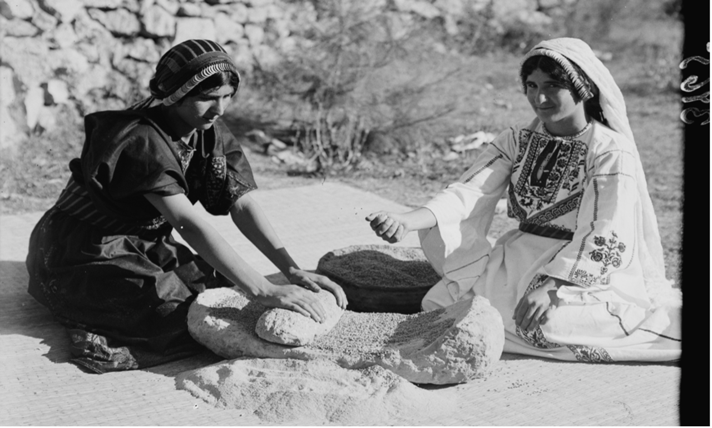{width="40%"} ![Wheat grinder volumetric video shoot [@sayedEngagingYouthHistory2024].](video-shoot-hist.png){width="46%"} ![Wheat grinding scene in a recreated 3D village [@sayedEngagingYouthHistory2024].](in-village.jpg){width="55%"}

<aside class="notes">
When a serious game is built with the goal of preserving history.
    
_Once Upon a Time in Palestine_ XR Documentary. Made out of the American University of Sharjah in the UAE. It's an “extended reality” (umbrella term for AR, VR, MR) historical reconstruction of Palestinian villages, oral history and a section of the old city of Jerusalem, made in Unity.
[@sayedEngagingYouthHistory2024]

Bloom’s learning goals (Cognitive, psychomotor, affective)
</aside>

## Heritage Awareness
{width="40%"}
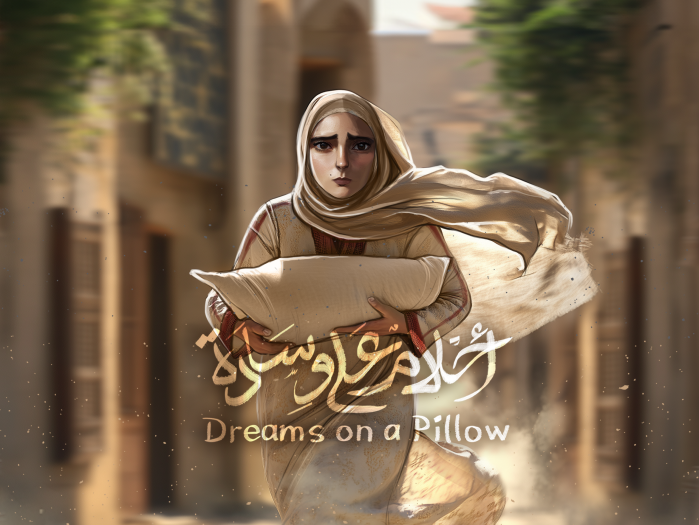{width="30%"} {width="45%"} {width="45%"}
<aside class="notes">
This is when a game sets out to teach about the heritage of a people. Heritage meaning something that is passed down from preceding generations.

Pictured here is Dreams on a Pillow. A game based on Palestinian folklore surrounding the legend of Omm, a young mother who is forced to flee Tantura, a town in northern Palestine, and like my Mom's side of the family, makes her way to Lebanon. This is a folklore passed down from generation to generation. [@abueidehDreamsPillowVideogame2025]

Bloom’s learning goals (Cognitive, psychomotor, affective)
</aside>

## Importance

> [Before] Palestinians can live in a free Palestine, they have to create a free Palestine in their imagination through stories, films, novels, and the arts [@alareerIfMustPoetry2024, p. xviii]

<aside class="notes">
(Read quote)
These projects provide a foundation. My "critique," if you can call it that, is that foundations don't do much to imagine a future, just allow you to understand the past. Helpful, but the next step is looking to the future.
</aside>

---

## Key Concept 2: Context of Use
<aside class="notes">
    Where and how these games are played.
</aside>

## Static Set-up

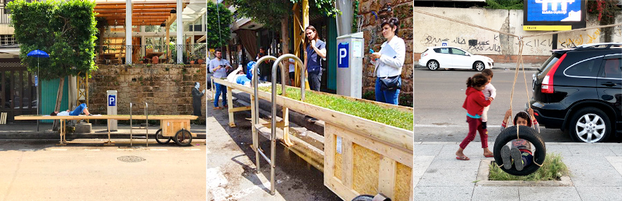

<aside class="notes">
The first context is static. Something setup in a physical location like a museum or city.
    
“Come and play” by Gemayzeh and Mar Mikhael [@mullerArchitectureStudentsReflect2018]

Using physical installations and performances by students, their friends, and a small fleet of service taxi drivers, Gemayzeh and Mikhael made a game revolving around the concept of “play as a survival kit.”

- Groups of four viewers were ushered into a service taxi, which at one point went down an impossibly narrow alley—with just centimeters to spare on each side of the car—and stopped in front of a doorway where a performer entered the already full taxi, forcing those in the back seat to make room for another occupant.
- At another stop on the route, the students constructed an elongated cart covered in real grass with a person sunbathing on it, highlighting the lack of public space in Beirut.
    - The cart even had a time-stamped parking ticket since it was in a parking space.
- In an attempt to draw attention to how little green space there is for children to play in Beirut, they hung a tire swing over this small patch of grass. Neighborhood children immediately came to play on the swing, highlighting how these installations are very different than classroom exercises since they necessarily involve​ interactions with the public.

</aside>

## Augmented Visit

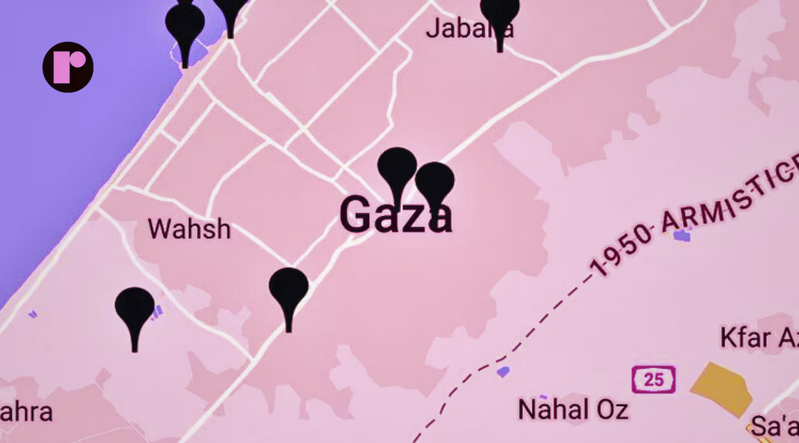
<aside class="notes">
This is using augmented reality technology (usually smartphones) to provide information and learning during a visit.

Pictured here is Queering the Map. Queering the Map is a community generated counter-mapping platform for digitally archiving LGBTQ2IA+ experience in relation to physical space.

 During the recent genocide war on Gaza, this platform received some press coverage for it’s use in Palestine. LGBTQ Palestinians in Gaza shared their last words amidst mass death. The digital hub became a last resort for anonymous declaration of queer love and grief.
[@LGBTQPalestiniansGaza2023]

This did a lot to counter the (frankly disgusting and racist) narrative that “oh if you’re queer, and you went to Gaza the Palestinians would do [insert crime here] to you.”
</aside>

## Stand alone
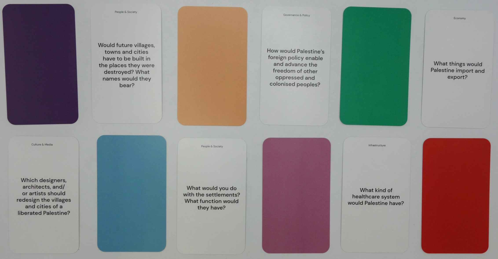

<aside class="notes">
This is the one we are most accustomed to I think. This is where a game is made for engagement at home or in a classroom.
    
So many examples here. See the previous section for a lot more.

For this section I want to present a project that addresses the critique I had in the last section.

Countless Palestinian Futures (CPF) is a discussion-based game that creates tangible ideas around Palestinian futures. It centres imagination as an educational tool to build ideas of liberation and cultivate conceptual and material alliances between the very people who are systematically denied their return.

These are some questions in the game.

</aside>

## Engagement
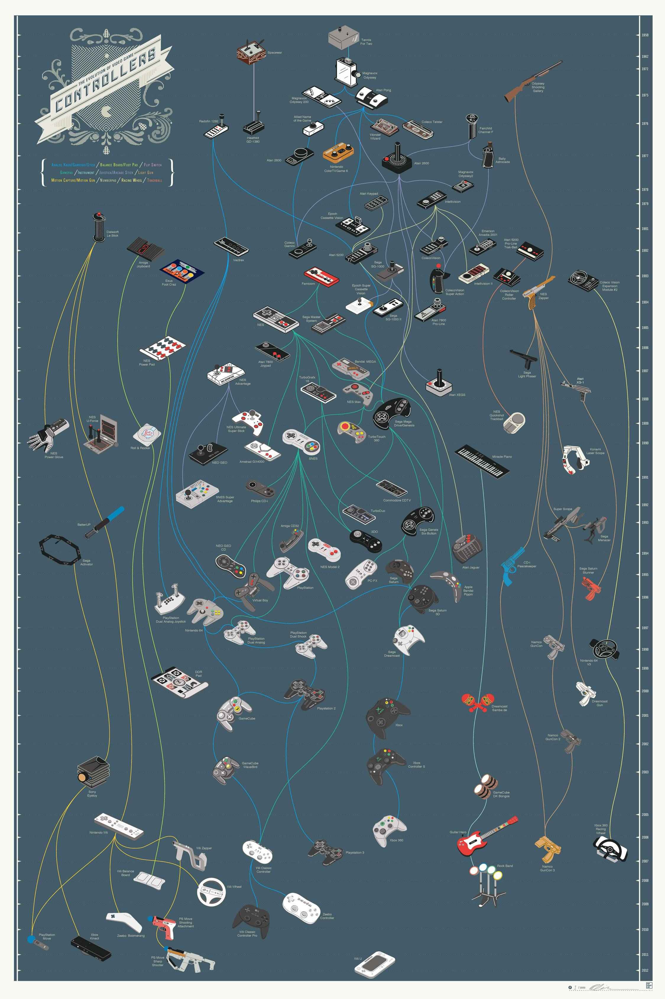{width=400px}
{width=360px style="margin-bottom: 100px"}

<aside class="notes">
Requires 2 things: 
1. Appealing and meaningful environment 
2. Suited and intuitive interaction paradigm

For meaningful environment is can be difficult to show so instead let me tell a story about walking to the gym during undergrad. (tell story)

For Suited and intuitive interaction paradigms, learning outcomes are improved when controllers are close to a task, and the environment of play is close to the environment of application.

Where does genre fit into this discussion? 
The article asserts that adventure games are particularly suited to implement the “learning by doing” approach. Are some genres simply better than others when it comes to learning outcomes?

Action games are the least represented category here. 

The article argues that action games require accurate and quick moves to perform tasks like shooting or avoiding obstacles, mechanics which are hardly related to cognitive gain, and should therefore be relegated to sub-tasks or mini-games for the sake of engagement. 

Does anyone want to share any thoughts or comments about that statement? Agree? Disagree?

</aside>

## Exercise

Pick a cultural element you’d like to see expressed from your own culture. Then using one of the set-up types (static, augmented visit, or standalone), create a game concept. 

- What would be its learning goal (cognitive, psychomotor, affective)?
- What genre would this game be?
- What interaction paradigm would it have?
- What environment will learner be in, and how will that environment contribute to your learning objective?

---

## Key Take Aways & Further Questions

<aside class="notes">
    
Expression is political. Indigenous cultures tell these stories as a means of survival.
    
Expression is preservation. If we stop telling these stories they will eventually fade, and that’s what settler society as a whole would like to have happen.

There are key aspects of culture that we are trying to protect, tangible and intangible.

Expression is teaching, games that seek to express a culture are also involved in teaching about that culture.

Any questions?

</aside>

# References
