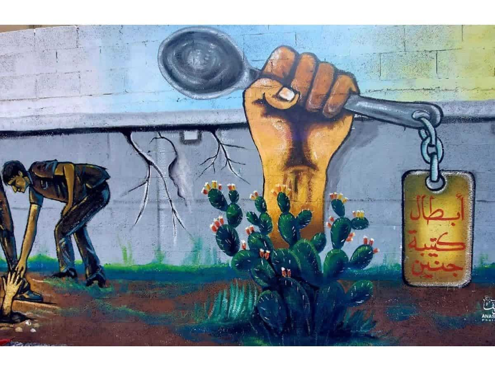
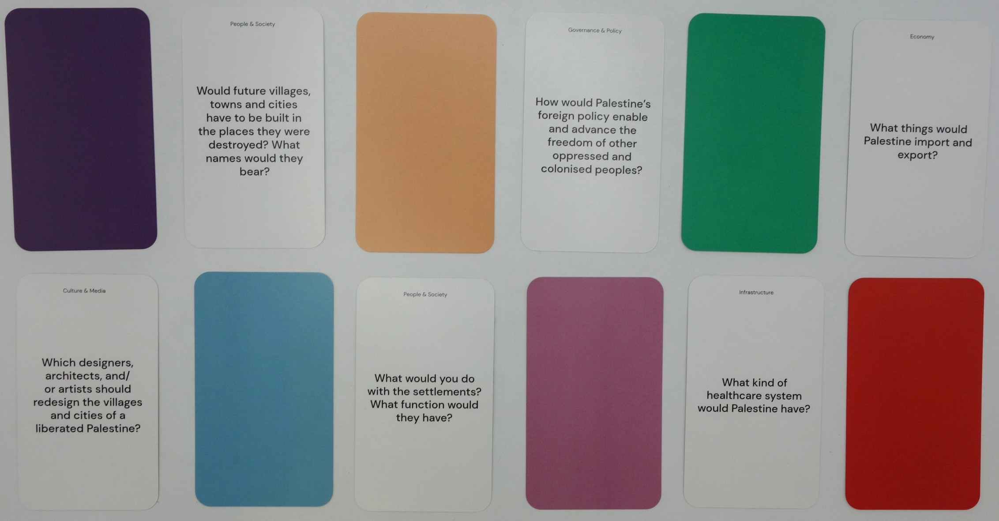

## Agenda

1. The Social Relationship Between Games and Learning
2. Semiotics
3. How Games/Play Transmit Culture
4. Imagining Futures

## The Social Relationship Between Games and Learning

<aside class="notes">
    
At this point, we are well aware of the synergistic relationship between Games and Learning. Game can be used as tool for motivation and generally fulfill that task quite well. This presentation is going to go in a bit of a different direction. How can game themselves be part of cultural transmission, irrespective of their motivational component.
    
According to @gol-guvenPlayFlowChildrens2017 whether a society supports children’s play or not is an indicator of the so-called “value of play.” She gives 3 basic levels of support:

- culturally curtailed play: play is not notably appreciated: some games are discredited so that children do not play these games
- culturally accepted play: play is seen as an activity that keeps children out of the way
- culturally cultivated play: play is accepted and the fact that adults play with children is recognized as important

She further goes on to talk about “cultural denial:” a phenomenon where adults are unable to participate in children’s play due to the constraints of maintaining the demanding pace of their own adult existence, but also that of children’s play being seen as a waste of time.

Basically, under capitalism, play has a fraught relationship with culture. Any cultural practices that aren’t necessarily in line with the capital mode of production are not allowed to be interacted or “played” with. You’ll find that many games have an underlying logic that furthers certain status quos. 

</aside>

## Semiotics 

The Kite, The Key

{height=200px} {height=200px}

The Spoon, The Gun

{height=200px}{height=200px}

<aside class="notes">

Semiotics is the study of signs and symbols and how they create meaning. It explores how signs communicate both intentional and unintentional messages in various forms, including language, images, and gestures.

A lot of the job of cultural education is teaching about the semiotics of a people/culture. Pictured here are some “revolutionary objects” in Palestinian culture as described by @matarForgingRevolutionaryObjects2024. Each one has a story that is deeply embedded Palestinian culture. For a game to teach about Palestinian culture it would need to teach our semiotics.

If I must die,
you must live
to tell my story
to sell my things
to buy a piece of cloth
and some strings,
(make it white with a long tail)
so that a child, somewhere in Gaza
while looking heaven in the eye
awaiting his dad who left in a blaze–
and bid no one farewell
not even to his flesh
not even to himself–
sees the kite, my kite you made, flying up above
and thinks for a moment an angel is there
bringing back love
If I must die
let it bring hope
let it be a tale

</aside>

## How Games Transmit Culture

<aside class="notes">

Pictured is the book cover for “Beyond a Boundary” by CLR James. The book is ostensibly about cricket and James’ life growing up in colonial Trinidad, and demonstrates the connections between race, class, values, and play. The British culturally cultivated play in order to further their colonial rule over Trinidad.

One key theme the book argues is that play/non-play don’t have clean boundaries. At best, that boundary is porous, if it exists at all. The cricket field, the game board, the video game, they invariably have aspects of the “real world” embedded within them that passively teaches those who play about this so-called “real world.”

Players learn about culture through engaging with these games. In James’ case he was being taught British culture by way of engaging with cricket. Passively through the environment and actively through the rules and systems of the game.

For this engagement to be successful in teaching the culture it would have had to have 2 main features:
1. An appealing and meaningful environment 
2. A suited and intuitive interaction paradigm

We will go over the passive and active transmission of culture as well as these tenants of good engagement in the following slides.

</aside>

## Passive Cultrual Transmission
<iframe width="560" height="315" src="https://www.youtube.com/embed/tesHn9YvhPg?si=_TA2YWxZTsiDsg2O" title="YouTube video player" frameborder="0" allowfullscreen></iframe>

<aside class="notes">

Before I get into the nasty examples, let’s start off with a way this can be used for good. Islamophobia is on the rise. Recently a woman wearing a headscarf in Ajax was attacked and almost lit on fire by an islamophobe. Ignorance is known to fuel hatred like this. I would argue the active campaigns against the new Assassin’s Creed titles by the usual suspects (racists, mysogynsts, etc) is a way to culturally curtailed play of these games to prevent the culture embedded in these games from spreading.

Before going into the more messy examples, let’s watch a light hearted example. 

This video shows Muslim call to prayer being played during the day night cycle of Assasin’s Creed Mirage. As some in the class may know, Muslims pray 5 times a day at specific times. The call to prayer is played from in game Mosques at the proper times.

This is a background element of the game that does a lot to provide the player some context about the world they’re currently occupying.

</aside>

## James On the “Boundary”

[As] soon as we stepped on to the cricket or football field, more particularly the cricket field, all was changed. We were a motley crew. The children of some white officials and white business men, middleclass blacks and mulattos, Chinese boys... and some poor black boys who had won exhibitions or whose parents had starved and toiled on plots of agricultural land and were spending their hard-earned money on giving the eldest boy an education [@jamesBoundary50thAnniversary2013, p. 25].

## Engagement: Environment

<aside class="notes">

Our brain releases cocktails of chemicals depending on the environment. This cocktail is so important that they can make the difference between a drug user surviving a dose, vs overdosing, with the same among of drugs. The closer the environment of learning is to the environment the player will end up using that information in, the better the learning outcomes.

CLR James was able to demonstrate how cricket’s embedded logic taught Britain’s colonial subjects British tradition. Can yall think of any other examples of games where the game’s environment (the field, the board etc) teach us about the culture they come from?

</aside>

## Active Cultural Transmission

<aside class="notes">

Then there is the process and systems. Rules and order. These aspects of the game instill values, norms, etc…

I wrote an article (that I can share with those interested) about how the Bonfires in Dark Souls are colonial outposts. This system of these small outposts of so-called “civilization” between areas of “barbarism” is, I argue, analogous to the system of settler colonialism.

</aside>

## Engagement Part 2: Interaction Paradigm

<aside class="notes">

The closer the interaction paradigm is to the desired performance, the easier the learning will translate to the real world. It isn’t enough to embed the logic into the game, you must find a way for the embedded logic to make itself manifest on the world.

</aside>

## Engagement Part 2: Interaction Paradigm Part 2

<aside class="notes">

And Vice-Versa right. You can make a game that models its controls after existing tools you’re trying to teach.

</aside>

## Imagining Futures

<aside class="notes">

Where do we go from here? @abdullaImaginingReturnCountless2024 are looking to the future to teach about the present. Countless Palestinian Futures (CPF) is a discussion-based game that creates tangible ideas around Palestinian futures. It centres imagination as an educational tool to build ideas of liberation and cultivate conceptual and material alliances between the people.

</aside>

## Exercise: Countless Canadian Futures?

<aside class="notes">

With a federal election coming up, let’s take a couple of minutes to imagine what we’d like this country to look like in the coming years? What kind of culture we’d like to have.

</aside>

## References
